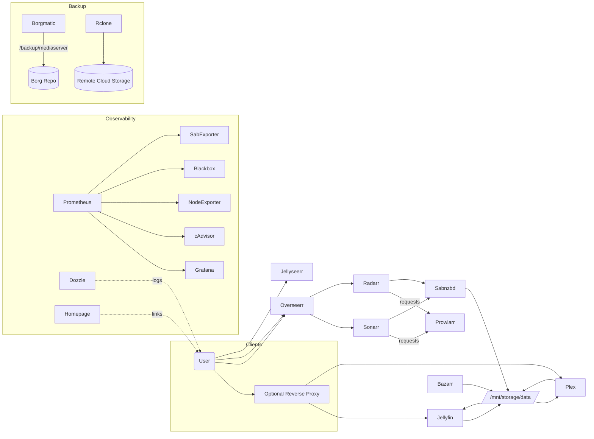

# Media Server Architecture (Docker Compose)

This document describes the end‑to‑end architecture of the Docker Compose–based media server, including the core media applications, observability stack with Prometheus and Grafana, automated updates, and encrypted, off‑site backups powered by borgmatic and rclone.

## High‑Level Overview

- Two Compose stacks:
  - `compose.yml` runs core media services (Jellyfin, Plex, *arr apps, SABnzbd, Bazarr, Tautulli, etc.), security (Fail2ban), and automation (Watchtower, Borgmatic, rclone helper).
  - `homepage-stack.yml` runs the dashboard and monitoring (Homepage, Dozzle, Filebrowser, Prometheus, Grafana, Blackbox Exporter, cAdvisor, Node Exporter, SABnzbd exporter).
- A single bridge network `media_net` connects services. Plex uses host networking for best client compatibility.
- Configuration lives under `/opt/mediaserver/*` on the host. Media libraries are mounted from `/mnt/storage/data`.
- Backups are created locally with Borg (via borgmatic) and synced off‑site with rclone. Secrets and credentials are kept out of the repository.

## Service Inventory (by function)

- Media servers and UIs
  - `jellyfin` (8096): Media server with VAAPI hardware transcoding via `/dev/dri`.
  - `plex` (host network: 32400): Media server, host networking for DLNA/remote discovery; Quick Sync via `/dev/dri`.
  - `jellyseerr` (5055) and `overseerr` (5155→5055): Request portals for users.
  - `tautulli` (8181): Plex activity analytics and history.
- Content automation
  - `sonarr` (8989): TV automation.
  - `radarr` (7878): Movies automation.
  - `prowlarr` (9696): Indexer management for *arr apps.
  - `sabnzbd` (8080): Usenet downloader.
  - `bazarr` (6767): Subtitle management.
  - `recyclarr`: Sync TRaSH‑Guides quality and naming profiles to *arr apps (on‑demand).
- Security and maintenance
  - `fail2ban` (host network): Bans abusive IPs using host iptables; tails Plex logs.
  - `watchtower`: Automated container image updates with Discord notifications (via Shoutrrr).
- Backups and off‑site sync
  - `mediaserver-backup` (borgmatic): Encrypted, deduplicated backups to `/mnt/backup/mediaserver` (cron: 03:30 daily).
  - `rclone_backup` (cron: 04:10 daily): Syncs Borg archives to remote (e.g., `gdrive:mediaserver-borg`).
- Observability and dashboard
  - `homepage` (3000): Central dashboard and quick links/widgets.
  - `dozzle` (9999): Live container logs.
  - `filebrowser` (8081): Simple file manager for mounted paths.
  - `prometheus` (9090): Metrics TSDB and scraping.
  - `grafana` (3001→3000): Dashboards; provisioned Prometheus datasource.
  - `blackbox_exporter` (9115): HTTP probe checks (e.g., Homepage).
  - `cadvisor` (8082): Per‑container metrics.
  - `node_exporter` (9100): Host metrics via `/:/host:ro` mount.
  - `sab_exporter` (9707): SABnzbd exporter via exportarr.

See definitions in `compose.yml` and `homepage-stack.yml` for exact images, ports, and volumes.

## Network Topology

- Default bridge: `media_net` (external in `homepage-stack.yml`, named in `compose.yml`).
- Plex runs with `network_mode: host` to improve client discovery and DLNA performance.
- Prometheus scrapes exporters by service name on `media_net`.
- Optional reverse proxy can be added later; subpaths should set base URLs in app configs.

## Storage, Paths, and Permissions

- Media libraries: `/mnt/storage/data` and `/mnt/storage/data/media` mounted read/write into services that need it.
- App configs: under `/opt/mediaserver/<service>` (e.g., `/opt/mediaserver/sonarr`, `/opt/mediaserver/plex/config`).
- Hardware acceleration: `/dev/dri:/dev/dri` passed to `jellyfin` and `plex` for VAAPI/Quick Sync.
- PUID/PGID/UMASK: set via `.env` to ensure consistent host‑level permissions on created files.
- Transcoding: optional fast scratch at `/opt/mediaserver/plex/transcode` for Plex.

## Monitoring and Dashboards

- Prometheus config: `prometheus/prometheus.yml` scrapes cAdvisor, Node Exporter, SAB exporter, and blackbox checks.
- Grafana provisioning: `grafana/provisioning/*` sets Prometheus datasource and dashboard folders.
- Homepage widgets show quick service status; Dozzle provides live logs.
- Common ports: Prometheus `9090`, Grafana `3001` (host → `3000` in container), Blackbox `9115`, cAdvisor `8082`, Node Exporter `9100`.

## Backups and DR

- Borgmatic container mounts configuration from `backup/config/`:
  - Schedule: `backup/config/crontab.txt` (default daily 03:30)
  - Core config: `backup/config/config.yaml`
  - Excludes: `backup/excludes.txt`
  - Hooks: `backup/pre-backup.sh`, `backup/post-backup.sh`
- Repository: `BORG_REPOSITORY=/mnt/backup/mediaserver` (host path bind‑mounted).
- Encryption: `BORG_PASSPHRASE` provided via `.env`; never commit secrets.
- Off‑site sync: `backup/rclone/crontab.txt` schedules nightly `rclone sync /data → gdrive:mediaserver-borg` (after Borg finishes). Run `rclone config` to set credentials.
- Restore strategy: verify `borg list`, `borg extract` in a test location; define RTO/RPO and document your test cadence.

## Key Data Flows

- Requests → Downloads → Library:
  - User requests via Overseerr/Jellyseerr.
  - Overseerr signals Sonarr/Radarr; Prowlarr supplies indexers.
  - SABnzbd downloads to `/mnt/storage/data`, renamed/moved by *arr into final libraries.
  - Bazarr fetches and manages subtitles.
  - Jellyfin/Plex libraries rescan and serve content to clients.
- Metrics pipeline:
  - Exporters → Prometheus → Grafana dashboards/alerts.
- Backup pipeline:
  - Files → Borgmatic → Borg repo → rclone → remote storage.

## Security Considerations

- Minimal privileges: run containers as `PUID:PGID` with `UMASK` tuned for shared group access.
- Network exposure: prefer LAN‑only bindings until reverse proxy/auth are configured; Plex uses host network by design.
- Secrets: `.env` holds non‑committed secrets (e.g., `BORG_PASSPHRASE`, API keys). Keep outside VCS.
- Fail2ban: host‑mode with iptables; tail Plex logs to block offenders. Validate jails and filters in `security/fail2ban`.
- Updates: Watchtower schedules rolling restarts; review changelogs before enabling auto‑updates broadly.

## Operations

- Bring up core stack: `docker compose up -d` (from repository root).
- Bring up monitoring/dashboard: `docker compose -f homepage-stack.yml up -d`.
- Check health:
  - Prometheus: http://localhost:9090
  - Grafana: http://localhost:3001
  - Homepage: http://localhost:3000
- On‑demand Recyclarr sync: `docker compose run --rm recyclarr sync`.
- Backup test:
  - `docker logs mediaserver-backup` to confirm schedule.
  - Validate repository: `docker compose exec mediaserver-backup borgmatic --list`.

## Sizing & Retention (guidance)

- Prometheus retention: 15d (configurable via `--storage.tsdb.retention.time`).
- Borg retention: daily/weekly/monthly/yearly as per `config.yaml`; adjust to storage budget and RPO.
- Transcoding: ensure SSD or tmpfs for smooth 4K transcodes.

## Future Enhancements

- Reverse proxy + SSO (e.g., NPM/Traefik + Authelia) for internet exposure.
- Alertmanager integration for actionable alerts (Slack/Email/Discord).
- Log aggregation (Loki/Promtail) to complement metrics.
- Automated config backup exports to the Borg repo for faster DR.

